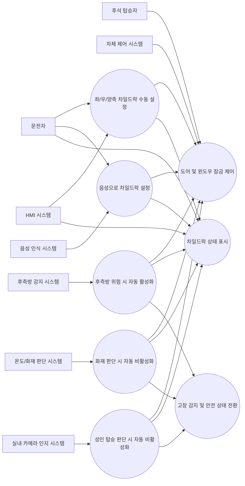

# 전자식 차일드락 소프트웨어 요구사항 명세서 (SwRS)

## 1. 문서 정보

### 1.1 목적
본 문서는 차량용 전자식 차일드락(Electronic Child Lock) 시스템의 소프트웨어 요구사항을 정의한다. 본 명세서는 이해관계자 요구사항을 소프트웨어 수준으로 구체화하고, 명확성, 일관성, 완전성, 검증 가능성, 추적 가능성을 만족하도록 작성한다.

### 1.2 범위
본 문서의 범위는 후석 좌우 도어 및 윈도우에 적용되는 전자식 차일드락 제어 소프트웨어이다. 본 소프트웨어는 차량 Human Machine Interface, 음성 인식 모듈, 후측방 감지 센서, 실내 카메라 기반 승객 분류 기능, 온도 센서, 차체 제어기와 연동하여 차일드락 상태를 판단하고 제어한다.

### 1.3 적용 기준
- Automotive SPICE 기반 요구사항 엔지니어링 원칙 적용
- ISO 26262 기반 기능 안전 요구사항 적용
- ISO/IEC 25010 기반 비기능 품질 특성 적용

### 1.4 문서 작성 원칙
- 각 요구사항은 고유 식별자를 가진다.
- 각 요구사항은 단일 의미를 가지며 시험 또는 분석으로 검증 가능해야 한다.
- 안전 관련 요구사항은 일반 기능 요구사항과 구분하여 식별한다.
- 본 문서에 포함된 추가 제안 요구사항 중 LLM이 보완 제안한 항목은 `[LLM 제안]`으로 표시한다.

## 2. 시스템 개요

### 2.1 시스템 개념
전자식 차일드락 시스템은 후석 탑승자의 오조작 또는 의도치 않은 도어 개방을 방지하기 위해 후석 도어의 실내 개방 기능과 후석 윈도우 조작 기능을 전자적으로 제한하는 시스템이다. 시스템은 운전자 입력 또는 자동 판단 로직에 따라 좌측, 우측 또는 양측 후석에 대해 독립적으로 활성화 또는 비활성화될 수 있어야 한다.

### 2.2 시스템 목표
- 후석 어린이 탑승 시 실내 도어 개방을 방지한다.
- 차일드락 활성 시 연계된 윈도우 조작을 제한한다.
- 운전자의 직관적 조작과 명확한 상태 인지를 보장한다.
- 주변 위험 상황에서는 자동 활성화를 통해 안전을 향상한다.
- 화재 또는 후석 성인 탑승과 같은 특수 조건에서는 자동 비활성화를 통해 탈출 가능성을 확보한다.

### 2.3 시스템 경계
소프트웨어는 다음 요소와 인터페이스한다.
- Center Display의 소프트 키 입력
- Voice Recognition 모듈의 명령 이벤트
- Blind Spot Detection 관련 센서 또는 차체 네트워크 메시지
- Cabin Camera 기반 후석 탑승자 분류 결과
- 실내 온도 센서 또는 화재 판단 입력
- Door Module / Body Control Module의 잠금 및 윈도우 제어 인터페이스
- Instrument Cluster 또는 Display 상태 표시 인터페이스

### 2.4 운영 가정
- 후석 좌우 도어 및 윈도우는 독립 제어 가능해야 한다.
- 센서 및 카메라 입력은 상위 또는 인접 제어기에서 전처리되어 유효 신호로 제공된다.
- 음성 인식 결과는 인식 성공 여부와 대상 좌석 정보를 포함할 수 있다.
- 차량 네트워크 통신 이상 시 안전 우선 정책이 적용되어야 한다.

## 3. 이해관계자 식별

| 이해관계자 | 식별 목적 | 대상 팀(현대자동차 기준 예시) | 이해관계자 요구사항 추출 기법 |
|---|---|---|---|
| 차량 사용자(운전자) | 조작 편의성, 상태 인지성, 안전성 확보 | 상품전략, UX기획, 인포테인먼트개발 | 인터뷰, 사용 시나리오 분석, 설문 |
| 후석 탑승자(어린이/성인) | 안전성, 비상 탈출 가능성 확보 | 차량성능시험, 안전성능개발 | 사용성 분석, 위험 사례 분석 |
| 차체 전장 시스템 개발자 | 제어 인터페이스 정의 및 통합성 확보 | 바디제어개발, 전장아키텍처 | 기술 워크숍, 인터페이스 분석 |
| HMI 개발자 | 화면 조작 흐름 및 상태 표시 정의 | 인포테인먼트 SW개발, UX개발 | 프로토타입 리뷰, UI 시나리오 분석 |
| 음성 인식 시스템 개발자 | 음성 명령 인터페이스 정의 | AI/음성인식개발 | 인터페이스 명세 검토 |
| 센서/인지 기능 개발자 | 자동 활성/비활성 조건 입력 정의 | ADAS개발, 실내인지개발 | 기능 인터페이스 검토, 데이터 분석 |
| 기능 안전 엔지니어 | 위험 분석 및 안전 메커니즘 정의 | 기능안전개발 | HARA, FMEA, 안전 분석 회의 |
| 시험/검증 엔지니어 | 검증 가능 요구사항 수립 | SW검증, 통합시험, 차량시험 | 테스트 관점 리뷰, 동등분할/경계값 분석 |
| 품질/프로세스 담당자 | 표준 및 추적성 준수 | 품질보증, ASPICE 추진 | 프로세스 리뷰, 산출물 감사 |
| 서비스/정비 조직 | 진단성 및 오류 대응성 확보 | 서비스기술개발 | 정비 시나리오 분석, 고장 사례 분석 |

## 4. 이해관계자 요구사항 식별

### 4.1 이해관계자 요구사항

| ID | 이해관계자 요구사항 |
|---|---|
| STR-001 | 운전자는 화면에서 후석 좌측, 우측, 양측 차일드락 상태를 선택적으로 설정할 수 있어야 한다. |
| STR-002 | 운전자는 차일드락 활성 여부를 명확히 인지할 수 있어야 한다. |
| STR-003 | 차일드락 활성 시 후석 탑승자는 차량 내부에서 해당 도어를 열 수 없어야 한다. |
| STR-004 | 차일드락 활성 시 해당 후석 윈도우 조작도 함께 제한되어야 한다. |
| STR-005 | 차량은 후측방 위험이 감지되면 자동으로 차일드락을 활성화하여야 한다. |
| STR-006 | 차량은 화재로 판단 가능한 상황에서는 후석 승객 탈출을 위해 차일드락을 자동 비활성화하여야 한다. |
| STR-007 | 차량은 후석에 성인이 앉은 것으로 판단되면 차일드락을 자동 비활성화할 수 있어야 한다. |
| STR-008 | 운전자는 음성 명령으로 차일드락을 제어할 수 있어야 한다. |
| STR-009 | 시스템은 오작동 또는 센서 이상 시 예측 가능한 안전 상태로 이행해야 한다. |
| STR-010 | 시스템은 시험 가능하고 진단 가능한 방식으로 구현되어야 한다. |
| STR-011 | [LLM 제안] 차량 전원 상태 변화 시 마지막 차일드락 설정의 복원 정책이 정의되어야 한다. |
| STR-012 | [LLM 제안] 자동 활성화 또는 자동 비활성화가 수행된 경우 운전자에게 그 사유가 표시되어야 한다. |

### 4.2 이해관계자 요구사항으로부터 도출된 소프트웨어 요구사항 방향
- 수동 제어 기능
- 자동 제어 기능
- 상태 표시 기능
- 입력 유효성 및 우선순위 판단 기능
- 고장 감지 및 Fail-safe 처리
- 성능 및 응답시간 보장
- 진단 및 로그 기록 기능

## 5. Actor 정의

| Actor | 정의 |
|---|---|
| 운전자 | 차일드락 기능을 수동 조작하거나 상태를 확인하는 주 사용자 |
| 후석 탑승자 | 차일드락 적용의 직접적 영향을 받는 사용자 |
| HMI 시스템 | 센터 디스플레이를 통해 소프트 키 입력과 상태 표시를 제공하는 외부 시스템 |
| 음성 인식 시스템 | 운전자의 음성 명령을 인식하여 제어 명령 이벤트를 제공하는 외부 시스템 |
| 후측방 감지 시스템 | 후측방 위험 여부를 제공하는 외부 시스템 |
| 실내 카메라 인지 시스템 | 후석 탑승자의 성인 여부 판정 결과를 제공하는 외부 시스템 |
| 온도/화재 판단 시스템 | 화재 가능 상황 또는 비정상 고온 상황을 제공하는 외부 시스템 |
| 차체 제어 시스템 | 도어 잠금, 도어 개방 제한, 윈도우 잠금 제어를 수행하는 외부 시스템 |
| 정비 진단 시스템 | 고장 코드 및 이벤트 로그를 읽는 서비스 도구 |

## 6. 기능 요구사항 및 Use Case 통합 명세

### 6.1 Use Case 다이어그램

### 6.2 Use Case별 통합 명세

#### UC-01 좌/우/양측 차일드락 수동 설정
- 목적: 운전자가 화면 소프트 키로 차일드락을 설정한다.
- 주요 Actor: 운전자
- 보조 Actor: HMI 시스템, 차체 제어 시스템
- 사전조건: 차량 전원 상태가 차일드락 제어 가능 상태이어야 한다.
- 트리거: 운전자가 HMI에서 좌측, 우측 또는 양측 차일드락 활성/비활성 명령을 선택한다.
- 기본 흐름:
  1. HMI 시스템은 사용자 선택 이벤트를 소프트웨어에 전달한다.
  2. 소프트웨어는 대상 좌석과 요청 상태를 판별한다.
  3. 소프트웨어는 입력 유효성을 확인한다.
  4. 소프트웨어는 차체 제어 시스템에 도어 및 윈도우 잠금 상태를 명령한다.
  5. 소프트웨어는 결과 상태를 표시 시스템에 반영한다.
- 예외 흐름:
  1. 입력 값이 유효하지 않으면 상태 변경 없이 오류를 기록한다.
  2. 차체 제어 시스템이 명령 수행 실패를 보고하면 운전자에게 실패 상태를 표시한다.
- 사후조건: 선택된 좌석의 차일드락 상태가 요청 상태와 일치해야 한다.
- 기능 요구사항:

| ID | 요구사항 | 검증 방법 |
|---|---|---|
| FR-001 | 소프트웨어는 후석 좌측, 후석 우측, 양측 후석에 대해 차일드락 상태를 독립적으로 설정할 수 있어야 한다. | 시험 |
| FR-006 | 소프트웨어는 HMI 소프트 키 입력을 통해 차일드락 활성/비활성 명령을 수신하고 처리하여야 한다. | 시험 |
| FR-013 | 소프트웨어는 차일드락 상태 변경이 완료되면 최신 상태를 저장하고 표시하여야 한다. | 시험 |
| FR-015 | 소프트웨어는 유효하지 않은 입력 또는 해석 불가 음성 명령에 대해 차일드락 상태를 변경하지 않아야 한다. | 시험 |
| FR-018 | 소프트웨어는 시스템 기동 후 초기 상태를 사전 정의된 기본값 또는 저장값으로 설정하여야 한다. | 시험 |
- 인터페이스 요구사항:

| ID | 요구사항 | 검증 방법 |
|---|---|---|
| IF-001 | HMI 입력 인터페이스는 대상 좌석과 요청 상태를 포함하여야 한다. | 분석, 시험 |

#### UC-02 음성으로 차일드락 설정
- 목적: 운전자가 음성 명령으로 차일드락을 설정한다.
- 주요 Actor: 운전자
- 보조 Actor: 음성 인식 시스템, 차체 제어 시스템, HMI 시스템
- 사전조건: 음성 인식 서비스가 사용 가능 상태여야 한다.
- 트리거: 음성 인식 시스템이 차일드락 관련 유효 명령을 전달한다.
- 기본 흐름:
  1. 음성 인식 시스템이 명령 종류와 대상 좌석 정보를 전달한다.
  2. 소프트웨어는 명령 의미를 해석하고 유효성을 검증한다.
  3. 소프트웨어는 수동 설정과 동일한 제어 절차를 수행한다.
  4. 소프트웨어는 수행 결과를 표시한다.
- 예외 흐름:
  1. 좌석 정보가 불명확하면 상태 변경을 수행하지 않고 재시도를 유도하는 피드백을 표시한다.
- 기능 요구사항:

| ID | 요구사항 | 검증 방법 |
|---|---|---|
| FR-007 | 소프트웨어는 음성 인식 시스템으로부터 활성/비활성 명령을 수신하고 처리할 수 있어야 한다. | 시험 |
| FR-015 | 소프트웨어는 유효하지 않은 입력 또는 해석 불가 음성 명령에 대해 차일드락 상태를 변경하지 않아야 한다. | 시험 |
- 인터페이스 요구사항:

| ID | 요구사항 | 검증 방법 |
|---|---|---|
| IF-002 | 음성 명령 인터페이스는 명령 종류, 대상 좌석, 인식 신뢰도 정보를 포함하여야 한다. | 분석, 시험 |

#### UC-03 후측방 위험 시 자동 활성화
- 목적: 후측방 접근 위험 시 승객의 도어 개방 위험을 줄이기 위해 자동 활성화한다.
- 주요 Actor: 후측방 감지 시스템
- 보조 Actor: 차체 제어 시스템, HMI 시스템
- 사전조건: 관련 센서 상태가 정상이어야 한다.
- 트리거: 후측방 위험 이벤트가 수신된다.
- 기본 흐름:
  1. 소프트웨어는 위험 방향(좌/우)을 판별한다.
  2. 소프트웨어는 해당 방향 후석 차일드락을 자동 활성화한다.
  3. 소프트웨어는 자동 활성화 사유를 운전자에게 표시한다.
- 예외 흐름:
  1. 센서 신뢰도가 기준 미만이면 자동 활성화를 수행하지 않고 진단 이벤트를 기록한다.
- 기능 요구사항:

| ID | 요구사항 | 검증 방법 |
|---|---|---|
| FR-008 | 소프트웨어는 후측방 위험 신호 수신 시 위험 방향에 해당하는 후석 차일드락을 자동 활성화하여야 한다. | 시험 |
| FR-011 | 소프트웨어는 자동 활성화 또는 자동 비활성화 수행 시 운전자에게 상태 변경 사유를 표시하여야 한다. | 시험 |
| FR-014 | 소프트웨어는 수동 제어와 자동 제어가 동시에 경합할 경우 사전에 정의된 우선순위 규칙에 따라 상태를 결정하여야 한다. | 분석, 시험 |
| FR-017 | 소프트웨어는 후측방 위험, 화재 판단, 성인 탑승 판단 입력의 유효 여부를 확인하여야 한다. | 시험 |
| FR-023 | 소프트웨어는 후측방 위험에 의한 자동 활성화보다 운전자의 명시적 비활성화 요청을 우선시하지 않아야 하며, 해당 정책은 안전 컨셉에 따라 구성 가능해야 한다. | 분석, 시험 |
| FR-026 | [LLM 제안] 소프트웨어는 자동 활성화 후 위험 신호가 해제되더라도 최소 유지 시간 동안 상태를 유지할 수 있어야 한다. | 시험 |
- 인터페이스 요구사항:

| ID | 요구사항 | 검증 방법 |
|---|---|---|
| IF-003 | 후측방 위험 인터페이스는 위험 방향, 이벤트 발생 시각, 신호 유효 상태를 포함하여야 한다. | 분석, 시험 |

#### UC-04 화재 판단 시 자동 비활성화
- 목적: 화재 또는 이에 준하는 비상 상황에서 후석 탑승자의 탈출 가능성을 확보한다.
- 주요 Actor: 온도/화재 판단 시스템
- 보조 Actor: 차체 제어 시스템, HMI 시스템
- 사전조건: 화재 판단 입력이 정상적으로 제공되어야 한다.
- 트리거: 화재 판단 조건 충족 이벤트가 수신된다.
- 기본 흐름:
  1. 소프트웨어는 화재 판단 조건을 검증한다.
  2. 소프트웨어는 활성화된 후석 차일드락을 즉시 비활성화한다.
  3. 소프트웨어는 운전자에게 비상 비활성화 상태를 표시한다.
- 기능 요구사항:

| ID | 요구사항 | 검증 방법 |
|---|---|---|
| FR-009 | 소프트웨어는 화재 판단 신호 수신 시 활성 상태인 모든 후석 차일드락을 자동 비활성화하여야 한다. | 시험 |
| FR-011 | 소프트웨어는 자동 활성화 또는 자동 비활성화 수행 시 운전자에게 상태 변경 사유를 표시하여야 한다. | 시험 |
| FR-014 | 소프트웨어는 수동 제어와 자동 제어가 동시에 경합할 경우 사전에 정의된 우선순위 규칙에 따라 상태를 결정하여야 한다. | 분석, 시험 |
| FR-017 | 소프트웨어는 후측방 위험, 화재 판단, 성인 탑승 판단 입력의 유효 여부를 확인하여야 한다. | 시험 |
| FR-021 | 소프트웨어는 화재 판단에 의한 자동 비활성화를 최우선 순위로 적용하여야 한다. | 분석, 시험 |
| FR-022 | 소프트웨어는 화재 판단 상태가 유효한 동안 다른 활성화 요청보다 비활성화 상태를 우선 적용하여야 한다. | 시험 |
- 인터페이스 요구사항:

| ID | 요구사항 | 검증 방법 |
|---|---|---|
| IF-005 | 온도/화재 판단 인터페이스는 화재 판단 플래그 또는 비상 고온 상태와 유효 상태를 포함하여야 한다. | 분석, 시험 |

#### UC-05 성인 탑승 판단 시 자동 비활성화
- 목적: 후석에 성인이 탑승한 경우 불필요한 차일드락 제한을 해제한다.
- 주요 Actor: 실내 카메라 인지 시스템
- 보조 Actor: HMI 시스템, 차체 제어 시스템
- 사전조건: 실내 카메라 기반 분류 기능이 정상이어야 한다.
- 트리거: 후석 성인 탑승 판정 결과가 수신된다.
- 기본 흐름:
  1. 소프트웨어는 해당 좌석의 성인 판정 결과를 확인한다.
  2. 소프트웨어는 판정 신뢰도가 기준 이상일 때 차일드락을 비활성화한다.
  3. 소프트웨어는 자동 비활성화 사유를 운전자에게 표시한다.
- 예외 흐름:
  1. 신뢰도가 기준 미만이면 현재 상태를 유지하고 이벤트만 기록한다.
- 기능 요구사항:

| ID | 요구사항 | 검증 방법 |
|---|---|---|
| FR-010 | 소프트웨어는 후석 성인 탑승 판정 신호 수신 시 해당 좌석 차일드락을 자동 비활성화할 수 있어야 한다. | 시험 |
| FR-011 | 소프트웨어는 자동 활성화 또는 자동 비활성화 수행 시 운전자에게 상태 변경 사유를 표시하여야 한다. | 시험 |
| FR-017 | 소프트웨어는 후측방 위험, 화재 판단, 성인 탑승 판단 입력의 유효 여부를 확인하여야 한다. | 시험 |
| FR-024 | 소프트웨어는 성인 탑승 자동 비활성화 적용 전에 판정 신뢰도 임계치를 확인하여야 한다. | 시험 |
- 인터페이스 요구사항:

| ID | 요구사항 | 검증 방법 |
|---|---|---|
| IF-004 | 실내 카메라 판정 인터페이스는 좌석 위치, 성인 여부, 판정 신뢰도, 데이터 유효 상태를 포함하여야 한다. | 분석, 시험 |

#### UC-06 차일드락 상태 표시
- 목적: 운전자가 현재 차일드락 상태와 상태 변경 원인을 인지하도록 한다.
- 주요 Actor: 운전자
- 보조 Actor: HMI 시스템
- 기본 흐름:
  1. 소프트웨어는 좌우 후석 상태를 분리하여 표시 데이터로 생성한다.
  2. 상태가 변경되면 변경 후 1초 이내에 표시를 갱신한다.
  3. 자동 제어에 의한 상태 변경이면 변경 사유를 함께 표시한다.
- 기능 요구사항:

| ID | 요구사항 | 검증 방법 |
|---|---|---|
| FR-011 | 소프트웨어는 자동 활성화 또는 자동 비활성화 수행 시 운전자에게 상태 변경 사유를 표시하여야 한다. | 시험 |
| FR-012 | 소프트웨어는 좌측과 우측 후석의 차일드락 상태를 개별적으로 표시하여야 한다. | 시험 |
| FR-013 | 소프트웨어는 차일드락 상태 변경이 완료되면 최신 상태를 저장하고 표시하여야 한다. | 시험 |
- 인터페이스 요구사항:

| ID | 요구사항 | 검증 방법 |
|---|---|---|
| IF-007 | 표시 인터페이스는 좌우 상태, 자동 제어 여부, 상태 변경 사유, 고장 경고 정보를 전달할 수 있어야 한다. | 분석, 시험 |

#### UC-07 도어 및 윈도우 잠금 제어
- 목적: 논리 상태를 물리 제어 명령으로 반영한다.
- 주요 Actor: 차체 제어 시스템
- 기본 흐름:
  1. 차일드락 활성 시 해당 도어의 실내 개방 금지와 해당 윈도우 조작 금지 명령을 함께 발행한다.
  2. 차일드락 비활성 시 해당 도어와 윈도우의 제한을 함께 해제한다.
- 기능 요구사항:

| ID | 요구사항 | 검증 방법 |
|---|---|---|
| FR-002 | 소프트웨어는 차일드락 활성 시 해당 후석 도어의 실내 개방 기능을 비활성화하여야 한다. | 시험 |
| FR-003 | 소프트웨어는 차일드락 활성 시 해당 후석 윈도우 조작 기능을 비활성화하여야 한다. | 시험 |
| FR-004 | 소프트웨어는 차일드락 비활성 시 해당 후석 도어의 실내 개방 제한을 해제하여야 한다. | 시험 |
| FR-005 | 소프트웨어는 차일드락 비활성 시 해당 후석 윈도우 조작 제한을 해제하여야 한다. | 시험 |
| FR-019 | 소프트웨어는 차체 제어 시스템으로부터 명령 적용 결과를 수신하고 논리 상태와 물리 상태의 불일치를 감지하여야 한다. | 시험 |
- 인터페이스 요구사항:

| ID | 요구사항 | 검증 방법 |
|---|---|---|
| IF-006 | 차체 제어 명령 인터페이스는 도어 실내 개방 제한 상태와 윈도우 잠금 상태를 좌석별로 전달하여야 한다. | 분석, 시험 |

#### UC-08 고장 감지 및 안전 상태 전환
- 목적: 입력 이상 또는 제어 실패 시 안전한 동작을 보장한다.
- 주요 Actor: 정비 진단 시스템
- 보조 Actor: HMI 시스템, 차체 제어 시스템
- 기본 흐름:
  1. 소프트웨어는 센서 입력 이상, 통신 단절, 명령 수행 실패를 감지한다.
  2. 소프트웨어는 사전에 정의된 안전 상태를 적용한다.
  3. 소프트웨어는 고장 코드를 저장하고 경고 또는 제한 상태를 표시한다.
- 기능 요구사항:

| ID | 요구사항 | 검증 방법 |
|---|---|---|
| FR-016 | 소프트웨어는 제어 명령 수행 실패 시 실패 상태를 운전자에게 표시하고 오류 이벤트를 저장하여야 한다. | 시험 |
| FR-017 | 소프트웨어는 후측방 위험, 화재 판단, 성인 탑승 판단 입력의 유효 여부를 확인하여야 한다. | 시험 |
| FR-020 | 소프트웨어는 진단 장비가 조회 가능한 방식으로 고장 코드와 최근 상태 변경 이벤트를 저장하여야 한다. | 시험 |
| FR-025 | 소프트웨어는 자동 상태 변경 이후 수동 조작이 허용되는 조건을 명시적으로 관리하여야 한다. | 분석, 시험 |

### 6.3 공통 상태 전이 및 우선순위 요구사항

| ID | 요구사항 | 검증 방법 |
|---|---|---|
| FR-014 | 소프트웨어는 수동 제어와 자동 제어가 동시에 경합할 경우 사전에 정의된 우선순위 규칙에 따라 상태를 결정하여야 한다. | 분석, 시험 |
| FR-021 | 소프트웨어는 화재 판단에 의한 자동 비활성화를 최우선 순위로 적용하여야 한다. | 분석, 시험 |
| FR-022 | 소프트웨어는 화재 판단 상태가 유효한 동안 다른 활성화 요청보다 비활성화 상태를 우선 적용하여야 한다. | 시험 |
| FR-023 | 소프트웨어는 후측방 위험에 의한 자동 활성화보다 운전자의 명시적 비활성화 요청을 우선시하지 않아야 하며, 해당 정책은 안전 컨셉에 따라 구성 가능해야 한다. | 분석, 시험 |
| FR-024 | 소프트웨어는 성인 탑승 자동 비활성화 적용 전에 판정 신뢰도 임계치를 확인하여야 한다. | 시험 |
| FR-025 | 소프트웨어는 자동 상태 변경 이후 수동 조작이 허용되는 조건을 명시적으로 관리하여야 한다. | 분석, 시험 |
| FR-026 | [LLM 제안] 소프트웨어는 자동 활성화 후 위험 신호가 해제되더라도 최소 유지 시간 동안 상태를 유지할 수 있어야 한다. | 시험 |

## 7. 비기능 요구사항

### 7.1 기능 적합성(Functionality Suitability)

| ID | 요구사항 | 검증 방법 |
|---|---|---|
| NFR-001 | 소프트웨어는 본 문서에 정의된 수동 제어, 자동 제어, 상태 표시, 고장 대응 기능을 완전하게 제공하여야 한다. | 리뷰, 시험 |
| NFR-002 | 소프트웨어는 좌측, 우측, 양측 제어에 대해 동일한 논리 일관성을 유지하여야 한다. | 리뷰, 시험 |

### 7.2 성능 효율성(Performance Efficiency)

| ID | 요구사항 | 최대 처리 시간 | 검증 방법 |
|---|---|---|---|
| NFR-003 | HMI 소프트 키 입력 수신부터 제어 명령 송신까지의 시간은 100 ms 이하여야 한다. | 100 ms | 시험 |
| NFR-004 | 음성 인식 결과 수신부터 제어 명령 송신까지의 시간은 150 ms 이하여야 한다. | 150 ms | 시험 |
| NFR-005 | 후측방 위험 이벤트 수신부터 차일드락 활성 명령 송신까지의 시간은 80 ms 이하여야 한다. | 80 ms | 시험 |
| NFR-006 | 화재 판단 이벤트 수신부터 차일드락 비활성 명령 송신까지의 시간은 50 ms 이하여야 한다. | 50 ms | 시험 |
| NFR-007 | 상태 변경 완료 후 HMI 표시 갱신 시간은 1 s 이하여야 한다. | 1 s | 시험 |
| NFR-008 | 소프트웨어의 주기적 상태 감시 태스크 실행 주기는 20 ms 이하여야 한다. | 20 ms | 분석, 시험 |

### 7.3 호환성(Compatibility)

| ID | 요구사항 | 검증 방법 |
|---|---|---|
| NFR-009 | 소프트웨어는 차체 제어 시스템, HMI 시스템, 음성 인식 시스템과 정의된 차량 네트워크 인터페이스를 통해 호환되어야 한다. | 분석, 통합시험 |
| NFR-010 | 소프트웨어는 동일 플랫폼의 좌핸들 및 우핸들 차량 구성에서도 좌우 좌석 정의 오류 없이 동작하여야 한다. | 분석, 시험 |

### 7.4 사용성(Usability)

| ID | 요구사항 | 검증 방법 |
|---|---|---|
| NFR-011 | 운전자는 현재 차일드락 상태를 2초 이내에 인지할 수 있도록 명확한 상태 표시를 제공받아야 한다. | 사용성 시험 |
| NFR-012 | 자동 활성화 또는 비활성화 시 표시 메시지는 원인과 대상 좌석을 포함하여야 한다. | 시험 |
| NFR-013 | 음성 인식 실패 시 사용자가 오동작으로 오해하지 않도록 상태 미변경 사실을 표시하여야 한다. | 시험 |

### 7.5 신뢰성(Reliability)

| ID | 요구사항 | 검증 방법 |
|---|---|---|
| NFR-014 | 입력 메시지 일시 손실 또는 지연이 1회 발생하더라도 소프트웨어는 이전 유효 상태를 유지하여야 한다. | 시험 |
| NFR-015 | 센서 유효 상태가 불명확한 경우 소프트웨어는 정의된 보수적 정책에 따라 동작하여야 한다. | 분석, 시험 |
| NFR-016 | 소프트웨어는 비정상 리셋 후에도 마지막 저장 상태 또는 안전 기본 상태로 일관되게 복구되어야 한다. | 시험 |

### 7.6 보안성(Security)

| ID | 요구사항 | 검증 방법 |
|---|---|---|
| NFR-017 | 외부 입력 메시지에 대한 형식 및 범위 검증을 수행하여 비정상 값으로 인한 오동작을 방지하여야 한다. | 분석, 시험 |
| NFR-018 | 진단 또는 개발 모드를 제외하고 인증되지 않은 인터페이스를 통한 차일드락 상태 변경은 허용되지 않아야 한다. | 분석, 시험 |

### 7.7 유지보수성(Maintainability)

| ID | 요구사항 | 검증 방법 |
|---|---|---|
| NFR-019 | 요구사항, 설계, 시험 항목 간 추적성이 확보되어야 한다. | 리뷰 |
| NFR-020 | 고장 코드, 상태 변경 사유, 입력 이벤트는 정비 분석이 가능하도록 로그화되어야 한다. | 시험, 리뷰 |
| NFR-021 | 우선순위 규칙, 임계치, 유지 시간은 보정 데이터 또는 구성 파라미터로 관리 가능해야 한다. | 분석, 시험 |

### 7.8 이식성(Portability)

| ID | 요구사항 | 검증 방법 |
|---|---|---|
| NFR-022 | 소프트웨어는 동일 차체 제어 아키텍처를 사용하는 파생 차종에 재사용 가능하도록 하드웨어 의존부를 인터페이스 계층으로 분리하여야 한다. | 리뷰 |

## 8. 기능 안전 요구사항

### 8.1 안전 목표
- 후석 어린이 탑승 상태에서 의도치 않은 실내 도어 개방을 방지한다.
- 비상 상황에서는 후석 탑승자의 탈출 가능성을 확보한다.
- 센서 또는 통신 이상 시 허용되지 않은 상태 전이를 최소화한다.

### 8.2 FMEA 기반 고장 시나리오

| 고장 형태 | 잠재 영향 | 잠재 원인 | 안전 메커니즘 |
|---|---|---|---|
| 차일드락 활성 실패 | 어린이의 도어 개방 가능 | 명령 누락, 통신 실패, 출력 이상 | 명령 결과 피드백 확인, 실패 경고, 재전송 또는 고장 저장 |
| 차일드락 비활성 실패 | 비상 시 탈출 불가 | 출력 스턱, 제어 로직 오류 | 화재 시 최우선 해제 명령, 물리 상태 확인, 고장 경고 |
| 잘못된 자동 활성화 | 성인 탑승자 불편, 불필요한 제한 | 센서 오검출 | 신뢰도 검증, 최소 유지 시간, 수동 재정의 정책 |
| 잘못된 자동 비활성화 | 어린이 보호 기능 상실 | 카메라 오분류, 화재 오판단 | 복수 조건 검증, 신뢰도 임계치, 진단 모니터링 |
| 좌우 좌석 매핑 오류 | 반대편 좌석 오동작 | 파라미터 오류, 통신 매핑 오류 | 차량 구성 검증, 통합 시험, 범위 검사 |
| 상태 표시 오류 | 운전자 오판 | HMI 통신 오류, 표시 데이터 불일치 | 상태 피드백 교차검증, 오류 표시 |

### 8.3 기능 안전 요구사항

| ID | 요구사항 | 검증 방법 |
|---|---|---|
| SFR-001 | 소프트웨어는 차일드락 활성 명령 송신 후 차체 제어 시스템의 피드백을 이용하여 명령 적용 여부를 확인하여야 한다. | 시험 |
| SFR-002 | 소프트웨어는 활성 명령 적용 실패가 검출되면 운전자에게 경고를 표시하고 고장 코드를 저장하여야 한다. | 시험 |
| SFR-003 | 소프트웨어는 화재 판단 입력이 유효한 경우 모든 후석 차일드락 비활성화를 최우선으로 수행하여야 한다. | 시험 |
| SFR-004 | 소프트웨어는 화재 판단 입력 상실 또는 불합리한 값에 대해 진단을 수행하고, 비상 관련 판단 로직 이상을 표시하여야 한다. | 시험 |
| SFR-005 | 소프트웨어는 후측방 센서, 실내 카메라, 화재 판단 입력의 신호 유효 상태를 주기적으로 모니터링하여야 한다. | 시험 |
| SFR-006 | 소프트웨어는 센서 신호가 정의된 시간 이상 갱신되지 않으면 해당 입력을 고장 상태로 판단하여야 한다. | 시험 |
| SFR-007 | 소프트웨어는 좌석 방향 또는 도어 채널 정보가 구성값과 불일치하는 경우 제어를 차단하고 고장 상태로 전이하여야 한다. | 시험 |
| SFR-008 | 소프트웨어는 논리 상태와 물리 피드백 상태가 불일치할 경우 안전 관련 고장으로 기록하여야 한다. | 시험 |
| SFR-009 | 소프트웨어는 단일 고장으로 인해 좌우 양측 상태가 동시에 비의도적으로 변경되지 않도록 독립 채널 관리를 지원하여야 한다. | 분석, 시험 |
| SFR-010 | [LLM 제안] 소프트웨어는 전원 투입 시 안전 관련 입력의 초기 유효성 확인이 완료되기 전까지 자동 상태 변경을 수행하지 않아야 한다. | 시험 |

### 8.4 안전 상태 정의
- 안전 상태 A: 화재 판단 시 모든 차일드락 비활성화
- 안전 상태 B: 센서 신뢰도 부족 시 자동 제어 차단, 마지막 유효 수동 상태 유지
- 안전 상태 C: 물리 상태 불일치 시 운전자 경고 및 추가 자동 제어 제한

## 9. 검증 전략

| 검증 유형 | 적용 내용 |
|---|---|
| 리뷰 | 요구사항의 명확성, 완전성, 추적성, 표준 준수성 검토 |
| 분석 | 우선순위 규칙, 인터페이스 정합성, 상태 전이 타당성 분석 |
| 단위 시험 | 입력 처리, 상태 판단, 우선순위 로직, 오류 처리 검증 |
| 통합 시험 | HMI, 음성 인식, 센서 입력, 차체 제어기 연동 검증 |
| 차량 시험 | 실제 도어/윈도우 동작, 상태 표시, 비상 해제 동작 검증 |
| 고장 주입 시험 | 센서 고장, 통신 단절, 잘못된 입력, 피드백 불일치 상황 검증 |
| 사용성 시험 | 운전자 상태 인지, 메시지 이해성, 조작 편의성 검증 |

## 10. 제약 및 LLM 보완 사항

### 10.1 원 요구사항 기반 제약
- 차일드락은 후석 도어와 윈도우를 함께 제어한다.
- 수동 활성화 수단은 화면 소프트 키를 포함해야 한다.
- 자동 활성화 조건은 후측방 위험 입력을 포함해야 한다.
- 자동 비활성화 조건은 화재 판단과 성인 탑승 판단을 포함해야 한다.

### 10.2 [LLM 제안] 보완 요구사항
- 마지막 상태 복원 정책 필요
- 자동 상태 변경 사유 표시 필요
- 자동 활성화 유지 시간 필요
- 전원 투입 초기 자동 판단 억제 필요

본 항목들은 사용자 원문에 직접 명시되지 않았으나, 명확성, 안전성, 검증 가능성 확보를 위해 추가되었다.

## 11. 약어(Full Name)

| 약어 | Full Name |
|---|---|
| SwRS | Software Requirements Specification |
| HMI | Human Machine Interface |
| LLM | Large Language Model |
| FMEA | Failure Mode and Effects Analysis |
| HARA | Hazard Analysis and Risk Assessment |
| BCM | Body Control Module |
| BSD | Blind Spot Detection |
