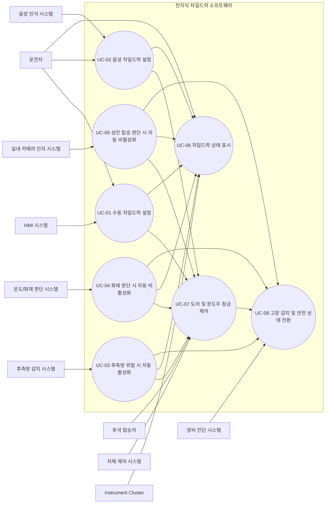

# 전자식 차일드락 소프트웨어 요구사항 명세서 (SwRS2)

## 1. 문서 정보

### 1.1 목적
본 문서는 차량용 전자식 차일드락(Electronic Child Lock) 시스템의 소프트웨어 요구사항을 정의한다. 본 명세서는 이해관계자 요구사항을 소프트웨어 수준의 요구사항으로 구체화하며, Automotive SPICE 요구사항 엔지니어링 관점에서 명확성, 일관성, 완전성, 검증 가능성, 추적 가능성을 만족하도록 작성한다.

### 1.2 범위
본 문서의 범위는 후석 좌측/우측 도어 및 윈도우에 적용되는 전자식 차일드락 제어 소프트웨어이다. 해당 소프트웨어는 Center Display 기반 소프트 키 입력, 음성 인식 명령, Blind Spot Detection 입력, 실내 카메라 기반 탑승자 분류 결과, 온도/화재 판단 입력, 차체 제어 시스템 피드백과 연동하여 차일드락 상태를 판단하고 제어한다.

### 1.3 적용 기준
- Automotive SPICE 기반 소프트웨어 요구사항 개발 원칙 적용
- ISO 26262 기반 기능 안전 요구사항 적용
- ISO/IEC 25010 기반 비기능 품질 특성 적용
- FMEA 기반 고장 형태 분석 결과를 기능 안전 요구사항에 반영

### 1.4 문서 작성 원칙
- 각 요구사항은 고유 식별자를 가진다.
- 각 요구사항은 단일 의미를 가지며, 시험, 분석, 리뷰, 검사 중 하나 이상의 방법으로 검증 가능해야 한다.
- 기능 요구사항, 인터페이스 요구사항, 비기능 요구사항, 기능 안전 요구사항은 구분하여 식별한다.
- 사용자 원문에 직접 존재하지 않는 보완 요구사항은 `[LLM 제안]`으로 식별한다.

## 2. 전자식 차일드락 시스템 개요

### 2.1 시스템 개념
전자식 차일드락 시스템은 후석 탑승자의 의도치 않은 실내 도어 개방을 방지하고, 차일드락 활성 시 해당 후석 윈도우 조작을 함께 제한하는 차량용 보호 기능이다. 시스템은 후석 좌측, 후석 우측, 양측을 구분하여 독립 제어할 수 있어야 하며, 운전자 수동 조작과 외부 입력에 기반한 자동 제어를 모두 지원하여야 한다.

### 2.2 시스템 목표
- 후석 어린이 탑승 시 실내 도어 개방 방지
- 차일드락 활성 시 후석 윈도우 조작 제한
- 운전자에게 명확한 상태 인지 제공
- 후측방 위험 상황에서 자동 활성화 수행
- 화재 및 후석 성인 탑승 조건에서 자동 비활성화 수행
- 오동작 또는 입력 이상 발생 시 예측 가능한 안전 상태 유지

### 2.3 시스템 경계
소프트웨어는 다음 외부 시스템과 인터페이스한다.
- HMI 시스템: 화면 소프트 키 입력 제공, 상태 표시 요청 수신
- 음성 인식 시스템: 차일드락 관련 음성 명령 이벤트 제공
- 후측방 감지 시스템: 좌/우 위험 방향 및 유효 상태 제공
- 실내 카메라 인지 시스템: 후석 성인 탑승 여부 및 신뢰도 제공
- 온도/화재 판단 시스템: 화재 판단 플래그 또는 비상 고온 이벤트 제공
- 차체 제어 시스템: 후석 도어 실내 개방 제한 및 윈도우 잠금 수행, 적용 결과 피드백 제공
- Instrument Cluster: 차일드락 상태 및 상태 변경 사유 표시
- 정비 진단 시스템: 이벤트 로그 및 고장 코드 조회

### 2.4 운영 가정
- 후석 좌측 도어/윈도우와 후석 우측 도어/윈도우는 독립적으로 제어 가능하다.
- 외부 센서 및 인지 입력은 상위 제어기 또는 센서 ECU에서 1차 유효성 검사를 거친 뒤 제공된다.
- 음성 인식 명령은 명령 종류, 대상 좌석, 인식 신뢰도 정보를 포함할 수 있다.
- 차량 네트워크 통신 이상이 발생한 경우 안전 우선 정책이 적용되어야 한다.

## 3. 이해관계자 식별

| 이해관계자 | 식별 목적 | 대상 팀(현대자동차 기준 예시) | 이해관계자 요구사항 추출 기법 |
|---|---|---|---|
| 차량 사용자(운전자) | 조작 편의성, 상태 인지성, 안전성 확보 | 상품전략, UX기획, 인포테인먼트개발 | 인터뷰, 사용 시나리오 분석, 설문 |
| 후석 탑승자(어린이/성인) | 안전성, 비상 탈출 가능성 확보 | 차량성능시험, 안전성능개발 | 사용성 분석, 위험 사례 분석 |
| 차체 전장 시스템 개발자 | 제어 인터페이스 정의 및 통합성 확보 | 바디제어개발, 전장아키텍처 | 기술 워크숍, 인터페이스 분석 |
| HMI 개발자 | 화면 조작 흐름 및 상태 표시 정의 | 인포테인먼트 SW개발, UX개발 | 프로토타입 리뷰, UI 시나리오 분석 |
| 음성 인식 시스템 개발자 | 음성 명령 인터페이스 정의 | AI/음성인식개발 | 인터페이스 명세 검토 |
| 센서/인지 기능 개발자 | 자동 활성/비활성 입력 조건 정의 | ADAS개발, 실내인지개발 | 기능 인터페이스 검토, 데이터 분석 |
| 기능 안전 엔지니어 | 위험 분석 및 안전 메커니즘 정의 | 기능안전개발 | HARA, FMEA, 안전 분석 회의 |
| 시험/검증 엔지니어 | 검증 가능 요구사항 수립 | SW검증, 통합시험, 차량시험 | 테스트 관점 리뷰, 동등분할/경계값 분석 |
| 품질/프로세스 담당자 | 표준 준수 및 추적성 확보 | 품질보증, ASPICE 추진 | 프로세스 리뷰, 산출물 감사 |
| 서비스/정비 조직 | 진단성 및 고장 대응성 확보 | 서비스기술개발 | 정비 시나리오 분석, 고장 사례 분석 |

## 4. 이해관계자 요구사항 식별

### 4.1 이해관계자 요구사항

| ID | 이해관계자 요구사항 |
|---|---|
| STR-001 | 운전자는 화면에서 후석 좌측, 우측, 양측 차일드락 상태를 선택적으로 설정할 수 있어야 한다. |
| STR-002 | 운전자는 차일드락 활성 여부를 명확히 인지할 수 있어야 한다. |
| STR-003 | 차일드락 활성 시 후석 탑승자는 차량 내부에서 해당 도어를 열 수 없어야 한다. |
| STR-004 | 차일드락 활성 시 해당 후석 윈도우 조작도 함께 제한되어야 한다. |
| STR-005 | 차량은 후측방 위험이 감지되면 자동으로 차일드락을 활성화하여야 한다. |
| STR-006 | 차량은 화재로 판단 가능한 상황에서는 후석 승객 탈출을 위해 차일드락을 자동 비활성화하여야 한다. |
| STR-007 | 차량은 후석에 성인이 앉은 것으로 판단되면 차일드락을 자동 비활성화할 수 있어야 한다. |
| STR-008 | 운전자는 음성 명령으로 차일드락을 제어할 수 있어야 한다. |
| STR-009 | 차일드락 활성 여부는 클러스터에 표시되어야 한다. |
| STR-010 | 시스템은 오작동 또는 센서 이상 시 예측 가능한 안전 상태로 이행해야 한다. |
| STR-011 | 시스템은 시험 가능하고 진단 가능한 방식으로 구현되어야 한다. |
| STR-012 | [LLM 제안] 차량 전원 상태 변화 시 마지막 차일드락 설정의 복원 정책이 정의되어야 한다. |
| STR-013 | [LLM 제안] 자동 활성화 또는 자동 비활성화가 수행된 경우 운전자에게 그 사유가 표시되어야 한다. |

### 4.2 이해관계자 요구사항으로부터 도출된 소프트웨어 요구사항 범주
- 수동 제어 기능
- 음성 기반 제어 기능
- 자동 활성화 기능
- 자동 비활성화 기능
- 상태 표시 기능
- 제어 우선순위 및 상태 전이 관리 기능
- 고장 감지, 진단, Fail-safe 기능
- 비기능 품질 및 자원 관리 요구사항

## 5. Actor 식별 및 정의

| Actor | 정의 |
|---|---|
| 운전자 | 차일드락 상태를 수동 제어하거나 상태를 확인하는 주 사용자 |
| 후석 탑승자 | 차일드락 적용의 직접적인 영향을 받는 사용자 |
| HMI 시스템 | Center Display를 통해 소프트 키 입력을 제공하고 상태 표시를 중계하는 외부 시스템 |
| 음성 인식 시스템 | 운전자의 음성 명령을 해석하여 제어 이벤트를 제공하는 외부 시스템 |
| 후측방 감지 시스템 | 좌/우 후측방 위험 신호를 제공하는 외부 시스템 |
| 실내 카메라 인지 시스템 | 후석 탑승자의 성인 여부 판정 결과를 제공하는 외부 시스템 |
| 온도/화재 판단 시스템 | 화재 또는 비상 고온 판단 결과를 제공하는 외부 시스템 |
| 차체 제어 시스템 | 후석 도어 실내 개방 제한 및 윈도우 잠금/해제를 수행하는 외부 시스템 |
| Instrument Cluster | 운전자에게 현재 차일드락 상태와 상태 변경 사유를 표시하는 외부 시스템 |
| 정비 진단 시스템 | 고장 코드 및 최근 이벤트 로그를 조회하는 서비스 도구 |

## 6. 기능 요구사항

### 6.1 Use Case 다이어그램

### 6.2 Use Case 명세서

#### UC-01 수동 차일드락 설정
- 목적: 운전자가 화면 소프트 키로 후석 좌측, 우측, 양측 차일드락을 설정한다.
- 주요 Actor: 운전자
- 보조 Actor: HMI 시스템, 차체 제어 시스템, Instrument Cluster
- 사전조건: 차량이 차일드락 제어 가능 전원 상태이고 HMI 시스템이 정상 동작 상태여야 한다.
- 트리거: 운전자가 HMI에서 차일드락 활성 또는 비활성 명령을 선택한다.
- 기본 흐름:
  1. HMI 시스템은 대상 좌석 및 요청 상태를 포함한 입력 이벤트를 전달한다.
  2. 소프트웨어는 입력 형식, 대상 좌석, 현재 상태, 우선순위 정책을 확인한다.
  3. 소프트웨어는 차체 제어 시스템에 도어 실내 개방 제한 및 윈도우 잠금 상태를 명령한다.
  4. 소프트웨어는 차체 제어 시스템 피드백을 수신하여 적용 여부를 확인한다.
  5. 소프트웨어는 결과 상태를 Instrument Cluster 및 HMI에 반영한다.
- 예외 흐름:
  1. 입력이 유효하지 않으면 상태를 변경하지 않고 이벤트 로그를 저장한다.
  2. 차체 제어 시스템이 명령 적용 실패를 응답하면 경고를 표시하고 고장 코드를 저장한다.
- 사후조건: 선택된 좌석의 논리 상태와 물리 상태가 일치해야 한다.

| ID | 요구사항 | 검증 방법 |
|---|---|---|
| FR-001 | 소프트웨어는 후석 좌측, 후석 우측, 양측에 대해 차일드락 상태를 독립적으로 설정할 수 있어야 한다. | 시험 |
| FR-002 | 소프트웨어는 차일드락 활성 시 해당 후석 도어의 실내 개방 기능을 비활성화하여야 한다. | 시험 |
| FR-003 | 소프트웨어는 차일드락 활성 시 해당 후석 윈도우 조작 기능을 비활성화하여야 한다. | 시험 |
| FR-004 | 소프트웨어는 차일드락 비활성 시 해당 후석 도어의 실내 개방 제한을 해제하여야 한다. | 시험 |
| FR-005 | 소프트웨어는 차일드락 비활성 시 해당 후석 윈도우 조작 제한을 해제하여야 한다. | 시험 |
| FR-006 | 소프트웨어는 HMI 소프트 키 입력을 통해 차일드락 활성/비활성 명령을 수신하고 처리하여야 한다. | 시험 |
| FR-013 | 소프트웨어는 차일드락 상태 변경이 완료되면 최신 상태를 저장하고 표시하여야 한다. | 시험 |
| FR-015 | 소프트웨어는 유효하지 않은 입력에 대해 차일드락 상태를 변경하지 않아야 한다. | 시험 |
| FR-018 | 소프트웨어는 시스템 기동 후 초기 상태를 사전 정의된 기본값 또는 저장된 정책값으로 설정하여야 한다. | 시험 |

| ID | 인터페이스 요구사항 | 검증 방법 |
|---|---|---|
| IF-001 | HMI 입력 인터페이스는 대상 좌석, 요청 상태, 요청 시각, 요청 출처를 포함하여야 한다. | 분석, 시험 |

#### UC-02 음성 차일드락 설정
- 목적: 운전자가 음성 명령으로 차일드락을 설정한다.
- 주요 Actor: 운전자
- 보조 Actor: 음성 인식 시스템, 차체 제어 시스템, Instrument Cluster
- 사전조건: 음성 인식 시스템이 사용 가능 상태여야 한다.
- 트리거: 음성 인식 시스템이 차일드락 관련 명령 이벤트를 전달한다.
- 기본 흐름:
  1. 음성 인식 시스템은 명령 종류, 대상 좌석, 인식 신뢰도를 전달한다.
  2. 소프트웨어는 명령 의미와 신뢰도를 검증한다.
  3. 소프트웨어는 UC-01과 동일한 제어 절차를 수행한다.
  4. 소프트웨어는 수행 결과를 표시한다.
- 예외 흐름:
  1. 대상 좌석이 모호하거나 신뢰도가 기준 미만이면 상태를 유지하고 명령 실패를 표시한다.

| ID | 요구사항 | 검증 방법 |
|---|---|---|
| FR-007 | 소프트웨어는 음성 인식 시스템으로부터 차일드락 활성/비활성 명령을 수신하고 처리할 수 있어야 한다. | 시험 |
| FR-015 | 소프트웨어는 해석 불가 또는 신뢰도 부족 음성 명령에 대해 상태를 변경하지 않아야 한다. | 시험 |

| ID | 인터페이스 요구사항 | 검증 방법 |
|---|---|---|
| IF-002 | 음성 명령 인터페이스는 명령 종류, 대상 좌석, 인식 신뢰도, 명령 시각을 포함하여야 한다. | 분석, 시험 |

#### UC-03 후측방 위험 시 자동 활성화
- 목적: 후측방 위험 상황에서 후석 도어 개방 위험을 낮추기 위해 차일드락을 자동 활성화한다.
- 주요 Actor: 후측방 감지 시스템
- 보조 Actor: 차체 제어 시스템, Instrument Cluster
- 사전조건: 후측방 감지 시스템 상태가 정상이고 신호가 유효해야 한다.
- 트리거: 좌측 또는 우측 후측방 위험 이벤트가 수신된다.
- 기본 흐름:
  1. 소프트웨어는 위험 방향 및 입력 유효 상태를 확인한다.
  2. 소프트웨어는 해당 방향 후석 차일드락을 자동 활성화한다.
  3. 소프트웨어는 자동 활성화 사유와 대상 좌석을 표시한다.
- 예외 흐름:
  1. 신호 유효 상태가 거짓이거나 갱신 시간이 초과되면 자동 활성화를 수행하지 않고 진단 이벤트를 저장한다.

| ID | 요구사항 | 검증 방법 |
|---|---|---|
| FR-008 | 소프트웨어는 후측방 위험 신호 수신 시 위험 방향에 해당하는 후석 차일드락을 자동 활성화하여야 한다. | 시험 |
| FR-011 | 소프트웨어는 자동 활성화 또는 자동 비활성화 수행 시 운전자에게 상태 변경 사유를 표시하여야 한다. | 시험 |
| FR-014 | 소프트웨어는 수동 제어와 자동 제어가 경합할 경우 사전에 정의된 우선순위 규칙에 따라 상태를 결정하여야 한다. | 분석, 시험 |
| FR-017 | 소프트웨어는 후측방 위험 입력의 유효 여부를 확인하여야 한다. | 시험 |
| FR-023 | 소프트웨어는 후측방 위험에 의한 자동 활성화가 필요한 동안 운전자의 비활성화 요청을 즉시 우선 적용하지 않아야 하며, 해당 정책은 안전 컨셉에 따라 구성 가능해야 한다. | 분석, 시험 |
| FR-026 | [LLM 제안] 소프트웨어는 자동 활성화 후 위험 신호가 해제되더라도 구성된 최소 유지 시간 동안 상태를 유지할 수 있어야 한다. | 시험 |

| ID | 인터페이스 요구사항 | 검증 방법 |
|---|---|---|
| IF-003 | 후측방 위험 인터페이스는 위험 방향, 신호 유효 상태, 이벤트 시각, 갱신 카운터를 포함하여야 한다. | 분석, 시험 |

#### UC-04 화재 판단 시 자동 비활성화
- 목적: 화재 또는 비상 고온 상황에서 후석 승객의 탈출 가능성을 확보한다.
- 주요 Actor: 온도/화재 판단 시스템
- 보조 Actor: 차체 제어 시스템, Instrument Cluster
- 사전조건: 화재 판단 입력 인터페이스가 동작 가능 상태여야 한다.
- 트리거: 화재 판단 플래그 또는 비상 고온 이벤트가 수신된다.
- 기본 흐름:
  1. 소프트웨어는 화재 판단 입력의 유효성을 확인한다.
  2. 소프트웨어는 활성화된 모든 후석 차일드락을 즉시 비활성화한다.
  3. 소프트웨어는 비상 비활성화 사유를 표시한다.

| ID | 요구사항 | 검증 방법 |
|---|---|---|
| FR-009 | 소프트웨어는 화재 판단 신호 수신 시 활성 상태인 모든 후석 차일드락을 자동 비활성화하여야 한다. | 시험 |
| FR-011 | 소프트웨어는 자동 활성화 또는 자동 비활성화 수행 시 운전자에게 상태 변경 사유를 표시하여야 한다. | 시험 |
| FR-014 | 소프트웨어는 수동 제어와 자동 제어가 경합할 경우 사전에 정의된 우선순위 규칙에 따라 상태를 결정하여야 한다. | 분석, 시험 |
| FR-017 | 소프트웨어는 화재 판단 입력의 유효 여부를 확인하여야 한다. | 시험 |
| FR-021 | 소프트웨어는 화재 판단에 의한 자동 비활성화를 최우선 순위로 적용하여야 한다. | 분석, 시험 |
| FR-022 | 소프트웨어는 화재 판단 상태가 유효한 동안 다른 활성화 요청보다 비활성화 상태를 우선 적용하여야 한다. | 시험 |

| ID | 인터페이스 요구사항 | 검증 방법 |
|---|---|---|
| IF-004 | 온도/화재 판단 인터페이스는 화재 판단 플래그, 비상 고온 상태, 신호 유효 상태, 이벤트 시각을 포함하여야 한다. | 분석, 시험 |

#### UC-05 성인 탑승 판단 시 자동 비활성화
- 목적: 후석에 성인이 탑승한 경우 불필요한 차일드락 제한을 해제한다.
- 주요 Actor: 실내 카메라 인지 시스템
- 보조 Actor: 차체 제어 시스템, Instrument Cluster
- 사전조건: 실내 카메라 인지 시스템이 정상 상태이고 분류 결과가 제공 가능해야 한다.
- 트리거: 후석 성인 탑승 판정 결과가 수신된다.
- 기본 흐름:
  1. 소프트웨어는 좌석 위치, 성인 여부, 판정 신뢰도를 확인한다.
  2. 소프트웨어는 해당 좌석 차일드락을 자동 비활성화한다.
  3. 소프트웨어는 자동 비활성화 사유를 표시한다.
- 예외 흐름:
  1. 판정 신뢰도가 기준 미만이면 현재 상태를 유지하고 이벤트만 저장한다.

| ID | 요구사항 | 검증 방법 |
|---|---|---|
| FR-010 | 소프트웨어는 후석 성인 탑승 판정 신호 수신 시 해당 좌석 차일드락을 자동 비활성화할 수 있어야 한다. | 시험 |
| FR-011 | 소프트웨어는 자동 활성화 또는 자동 비활성화 수행 시 운전자에게 상태 변경 사유를 표시하여야 한다. | 시험 |
| FR-017 | 소프트웨어는 성인 탑승 판단 입력의 유효 여부를 확인하여야 한다. | 시험 |
| FR-024 | 소프트웨어는 성인 탑승 자동 비활성화 적용 전에 판정 신뢰도 임계치를 확인하여야 한다. | 시험 |

| ID | 인터페이스 요구사항 | 검증 방법 |
|---|---|---|
| IF-005 | 실내 카메라 판정 인터페이스는 좌석 위치, 성인 여부, 판정 신뢰도, 데이터 유효 상태, 판정 시각을 포함하여야 한다. | 분석, 시험 |

#### UC-06 차일드락 상태 표시
- 목적: 운전자가 현재 차일드락 상태와 상태 변경 원인을 명확히 인지하도록 한다.
- 주요 Actor: 운전자
- 보조 Actor: HMI 시스템, Instrument Cluster
- 사전조건: 상태 표시 인터페이스가 정상 동작 상태여야 한다.
- 트리거: 차일드락 상태 변경 또는 주기적 상태 갱신 이벤트가 발생한다.
- 기본 흐름:
  1. 소프트웨어는 좌우 후석 상태를 개별적으로 표시 데이터로 생성한다.
  2. 자동 제어로 상태가 변경된 경우 변경 사유를 함께 생성한다.
  3. 소프트웨어는 HMI 및 Instrument Cluster에 갱신 데이터를 전송한다.

| ID | 요구사항 | 검증 방법 |
|---|---|---|
| FR-012 | 소프트웨어는 좌측과 우측 후석의 차일드락 상태를 개별적으로 표시하여야 한다. | 시험 |
| FR-013 | 소프트웨어는 차일드락 상태 변경이 완료되면 최신 상태를 저장하고 표시하여야 한다. | 시험 |
| FR-027 | 소프트웨어는 차일드락 활성 여부를 Instrument Cluster에 표시하여야 한다. | 시험 |

| ID | 인터페이스 요구사항 | 검증 방법 |
|---|---|---|
| IF-006 | 상태 표시 인터페이스는 좌우 상태, 자동 제어 여부, 상태 변경 사유, 고장 경고 정보를 포함하여야 한다. | 분석, 시험 |

#### UC-07 도어 및 윈도우 잠금 제어
- 목적: 차일드락 논리 상태를 물리 제어 명령으로 반영한다.
- 주요 Actor: 차체 제어 시스템
- 사전조건: 차체 제어 시스템과의 통신이 가능해야 한다.
- 트리거: 차일드락 상태가 변경되거나 초기 동기화가 요구된다.
- 기본 흐름:
  1. 차일드락 활성 시 해당 좌석 도어 실내 개방 제한과 윈도우 잠금을 동시에 명령한다.
  2. 차일드락 비활성 시 해당 좌석 도어 실내 개방 제한과 윈도우 잠금을 동시에 해제한다.
  3. 소프트웨어는 적용 결과 피드백을 확인한다.

| ID | 요구사항 | 검증 방법 |
|---|---|---|
| FR-019 | 소프트웨어는 차체 제어 시스템으로부터 명령 적용 결과를 수신하고 논리 상태와 물리 상태의 불일치를 감지하여야 한다. | 시험 |
| FR-028 | 소프트웨어는 도어 실내 개방 제한과 윈도우 잠금 명령을 동일한 제어 주기 내에 발행하여야 한다. | 시험 |

| ID | 인터페이스 요구사항 | 검증 방법 |
|---|---|---|
| IF-007 | 차체 제어 명령 인터페이스는 좌석별 도어 실내 개방 제한 상태, 좌석별 윈도우 잠금 상태, 명령 시퀀스 번호를 포함하여야 한다. | 분석, 시험 |
| IF-008 | 차체 피드백 인터페이스는 좌석별 도어 제한 상태, 좌석별 윈도우 잠금 상태, 명령 적용 결과, 오류 코드를 포함하여야 한다. | 분석, 시험 |

#### UC-08 고장 감지 및 안전 상태 전환
- 목적: 입력 이상, 통신 단절, 명령 수행 실패 시 안전한 동작을 보장한다.
- 주요 Actor: 정비 진단 시스템
- 보조 Actor: HMI 시스템, Instrument Cluster, 차체 제어 시스템
- 사전조건: 진단 기능이 활성 상태여야 한다.
- 트리거: 입력 유효 오류, 갱신 시간 초과, 피드백 불일치, 통신 실패가 검출된다.
- 기본 흐름:
  1. 소프트웨어는 오류 유형을 분류한다.
  2. 소프트웨어는 사전에 정의된 안전 상태 또는 제한 상태를 적용한다.
  3. 소프트웨어는 고장 코드를 저장하고 운전자에게 경고를 표시한다.
  4. 정비 진단 시스템이 조회 가능한 형식으로 로그를 유지한다.

| ID | 요구사항 | 검증 방법 |
|---|---|---|
| FR-016 | 소프트웨어는 제어 명령 수행 실패 시 실패 상태를 운전자에게 표시하고 오류 이벤트를 저장하여야 한다. | 시험 |
| FR-020 | 소프트웨어는 진단 장비가 조회 가능한 방식으로 고장 코드와 최근 상태 변경 이벤트를 저장하여야 한다. | 시험 |
| FR-025 | 소프트웨어는 자동 상태 변경 이후 수동 조작이 허용되는 조건을 명시적으로 관리하여야 한다. | 분석, 시험 |
| FR-029 | 소프트웨어는 외부 입력 메시지가 정의된 최대 갱신 시간 내 수신되지 않으면 해당 입력을 비정상 상태로 판정하여야 한다. | 시험 |
| FR-030 | 소프트웨어는 고장 발생 시 안전 상태 전환 사유를 이벤트 로그에 저장하여야 한다. | 시험 |

| ID | 인터페이스 요구사항 | 검증 방법 |
|---|---|---|
| IF-009 | 진단 인터페이스는 고장 코드, 발생 시각, 관련 좌석, 관련 입력 채널, 최근 상태 전이 정보를 제공하여야 한다. | 분석, 시험 |

### 6.3 공통 상태 전이 및 우선순위 요구사항

| ID | 요구사항 | 검증 방법 |
|---|---|---|
| FR-014 | 소프트웨어는 수동 제어와 자동 제어가 동시에 경합할 경우 사전에 정의된 우선순위 규칙에 따라 상태를 결정하여야 한다. | 분석, 시험 |
| FR-021 | 소프트웨어는 화재 판단에 의한 자동 비활성화를 최우선 순위로 적용하여야 한다. | 분석, 시험 |
| FR-022 | 소프트웨어는 화재 판단 상태가 유효한 동안 다른 활성화 요청보다 비활성화 상태를 우선 적용하여야 한다. | 시험 |
| FR-023 | 소프트웨어는 후측방 위험에 의한 자동 활성화 정책을 안전 컨셉에 따라 구성 가능해야 한다. | 분석, 시험 |
| FR-024 | 소프트웨어는 성인 탑승 자동 비활성화 적용 전에 판정 신뢰도 임계치를 확인하여야 한다. | 시험 |
| FR-025 | 소프트웨어는 자동 상태 변경 이후 수동 조작 허용 조건을 명시적으로 관리하여야 한다. | 분석, 시험 |
| FR-026 | [LLM 제안] 소프트웨어는 자동 활성화 후 위험 해제 시점부터 구성된 최소 유지 시간이 경과하기 전까지 상태를 유지할 수 있어야 한다. | 시험 |
| FR-031 | [LLM 제안] 소프트웨어는 전원 Off 후 재기동 시 마지막 유효 상태 복원 정책 또는 기본 상태 초기화 정책 중 구성된 정책을 적용하여야 한다. | 시험 |

## 7. 비기능 요구사항

### 7.1 기능 적합성(Functionality Suitability)

| ID | 요구사항 | 검증 방법 |
|---|---|---|
| NFR-001 | 소프트웨어는 본 문서에서 정의한 수동 제어, 음성 제어, 자동 활성화, 자동 비활성화, 상태 표시, 진단 기능을 제공하여야 한다. | 리뷰, 시험 |
| NFR-002 | 좌측, 우측, 양측 제어에 대해 동일한 제어 규칙과 상태 표시 일관성을 유지하여야 한다. | 리뷰, 시험 |

### 7.2 성능 효율성(Performance Efficiency)

| ID | 요구사항 | 최대 처리 시간 | 검증 방법 |
|---|---|---|---|
| NFR-003 | HMI 소프트 키 입력 수신부터 차체 제어 명령 송신까지의 시간은 100 ms 이하여야 한다. | 100 ms | 시험 |
| NFR-004 | 음성 명령 수신부터 차체 제어 명령 송신까지의 시간은 150 ms 이하여야 한다. | 150 ms | 시험 |
| NFR-005 | 후측방 위험 이벤트 수신부터 자동 활성화 명령 송신까지의 시간은 80 ms 이하여야 한다. | 80 ms | 시험 |
| NFR-006 | 화재 판단 이벤트 수신부터 자동 비활성화 명령 송신까지의 시간은 50 ms 이하여야 한다. | 50 ms | 시험 |
| NFR-007 | 성인 탑승 판정 이벤트 수신부터 자동 비활성화 명령 송신까지의 시간은 200 ms 이하여야 한다. | 200 ms | 시험 |
| NFR-008 | 상태 변경 완료 후 HMI 및 Instrument Cluster 표시 갱신 시간은 1 s 이하여야 한다. | 1 s | 시험 |
| NFR-009 | 주기적 상태 감시 태스크 실행 주기는 20 ms 이하여야 한다. | 20 ms | 분석, 시험 |

### 7.3 자원 효율성(Resource Utilization)

| ID | 요구사항 | 최대 사용률 | 검증 방법 |
|---|---|---|---|
| NFR-010 | 정상 운행 조건에서 차일드락 소프트웨어의 평균 CPU 사용률은 할당 코어 기준 15% 이하여야 한다. | 15% | 성능 시험 |
| NFR-011 | 최악 조건 버스트 입력 시 차일드락 소프트웨어의 최대 CPU 사용률은 할당 코어 기준 30% 이하여야 한다. | 30% | 성능 시험 |
| NFR-012 | 실행 중 정적 및 동적 메모리 총 사용량은 20 MiB 이하여야 한다. | 20 MiB | 분석, 계측 시험 |
| NFR-013 | 이벤트 로그 저장을 위해 사용하는 비휘발성 메모리 총량은 2 MiB 이하여야 한다. | 2 MiB | 분석, 시험 |
| NFR-014 | 차일드락 관련 네트워크 메시지 송수신 대역 점유율은 할당 차량 네트워크 대역의 5% 이하여야 한다. | 5% | 분석, 통합시험 |

### 7.4 호환성(Compatibility)

| ID | 요구사항 | 검증 방법 |
|---|---|---|
| NFR-015 | 소프트웨어는 HMI 시스템, 음성 인식 시스템, 차체 제어 시스템과 정의된 차량 네트워크 인터페이스를 통해 호환되어야 한다. | 분석, 통합시험 |
| NFR-016 | 소프트웨어는 동일 플랫폼의 좌핸들 및 우핸들 차량 구성에서도 좌우 좌석 정의 오류 없이 동작하여야 한다. | 분석, 시험 |

### 7.5 사용성(Usability)

| ID | 요구사항 | 검증 방법 |
|---|---|---|
| NFR-017 | 운전자는 현재 차일드락 상태를 표시 후 2초 이내에 인지할 수 있도록 명확한 상태 표시를 제공받아야 한다. | 사용성 시험 |
| NFR-018 | 자동 활성화 또는 비활성화 시 표시 메시지는 원인과 대상 좌석을 포함하여야 한다. | 시험 |
| NFR-019 | 음성 명령 실패 시 사용자가 오동작으로 오해하지 않도록 상태 미변경 사실을 표시하여야 한다. | 시험 |

### 7.6 신뢰성(Reliability)

| ID | 요구사항 | 검증 방법 |
|---|---|---|
| NFR-020 | 입력 메시지 1회 손실 또는 단일 주기 지연 발생 시 소프트웨어는 이전 유효 상태를 유지하여야 한다. | 시험 |
| NFR-021 | 센서 유효 상태가 불명확한 경우 소프트웨어는 정의된 보수적 정책에 따라 동작하여야 한다. | 분석, 시험 |
| NFR-022 | 비정상 리셋 후에도 마지막 저장 상태 또는 안전 기본 상태로 일관되게 복구되어야 한다. | 시험 |

### 7.7 보안성(Security)

| ID | 요구사항 | 검증 방법 |
|---|---|---|
| NFR-023 | 외부 입력 메시지에 대한 형식 및 범위 검증을 수행하여 비정상 값으로 인한 오동작을 방지하여야 한다. | 분석, 시험 |
| NFR-024 | 정비 또는 개발 모드를 제외하고 인증되지 않은 인터페이스를 통한 차일드락 상태 변경은 허용되지 않아야 한다. | 분석, 시험 |

### 7.8 유지보수성(Maintainability)

| ID | 요구사항 | 검증 방법 |
|---|---|---|
| NFR-025 | 요구사항, 설계, 시험 항목 간 추적성이 확보되어야 한다. | 리뷰 |
| NFR-026 | 고장 코드, 상태 변경 사유, 입력 이벤트는 정비 분석이 가능하도록 로그화되어야 한다. | 시험, 리뷰 |
| NFR-027 | 우선순위 규칙, 임계치, 유지 시간은 구성 파라미터 또는 보정 데이터로 관리 가능해야 한다. | 분석, 시험 |

### 7.9 이식성(Portability)

| ID | 요구사항 | 검증 방법 |
|---|---|---|
| NFR-028 | 소프트웨어는 동일 차체 제어 아키텍처를 사용하는 파생 차종에 재사용 가능하도록 하드웨어 의존부를 인터페이스 계층으로 분리하여야 한다. | 리뷰 |

### 7.10 상세 검증 방법

| 검증 방법 | 상세 내용 |
|---|---|
| 리뷰 | 요구사항 문장 단일성, 모호성 제거, 추적성, 표준 준수 여부를 검토한다. |
| 분석 | 상태 전이표, 우선순위 표, 인터페이스 정의서, 자원 사용 분석 결과를 검토한다. |
| 단위 시험 | 입력 검증, 우선순위 결정, 오류 처리, 상태 저장/복원 로직을 검증한다. |
| 통합 시험 | HMI, 음성 인식, 센서 입력, 차체 제어기, 클러스터와의 인터페이스 정합성을 검증한다. |
| 차량 시험 | 실제 차량 또는 HIL 환경에서 도어/윈도우 동작, 표시, 비상 해제 기능을 검증한다. |
| 고장 주입 시험 | 입력 누락, 통신 단절, 피드백 불일치, 잘못된 좌석 정보, 센서 오검출을 주입하여 안전 상태 전환을 검증한다. |
| 성능 시험 | 최악 조건 이벤트 부하에서 응답 시간, CPU 사용률, 메모리 사용량을 계측한다. |
| 사용성 시험 | 운전자의 상태 인지 시간, 메시지 이해성, 오조작 가능성을 평가한다. |

## 8. 기능 안전 요구사항

### 8.1 안전 목표
- 후석 어린이 탑승 상태에서 의도치 않은 실내 도어 개방을 방지한다.
- 비상 상황에서는 후석 탑승자의 탈출 가능성을 확보한다.
- 센서, 통신, 제어 출력 단일 고장 시 허용되지 않은 상태 전이를 최소화한다.

### 8.2 FMEA 기반 고장 시나리오

| 고장 형태 | 잠재 영향 | 잠재 원인 | 안전 메커니즘 |
|---|---|---|---|
| 차일드락 활성 실패 | 어린이의 도어 개방 가능 | 제어 명령 누락, 통신 실패, 출력 회로 이상 | 명령 적용 피드백 확인, 실패 경고, 고장 코드 저장 |
| 차일드락 비활성 실패 | 화재 시 탈출 불가 | 출력 고착, 로직 오류, 피드백 누락 | 화재 시 최우선 비활성화, 피드백 교차검증, 고장 경고 |
| 잘못된 자동 활성화 | 성인 탑승자 불편, 불필요한 제한 | 후측방 센서 오검출, 방향 매핑 오류 | 입력 유효성 확인, 최소 유지 시간, 구성 검증 |
| 잘못된 자동 비활성화 | 어린이 보호 기능 상실 | 카메라 오분류, 화재 오판단 | 신뢰도 임계치, 입력 갱신 감시, 진단 모니터링 |
| 좌우 좌석 매핑 오류 | 반대편 좌석 오동작 | 구성값 오류, 네트워크 매핑 오류 | 좌석 채널 검증, 통합 시험, 범위 검사 |
| 상태 표시 오류 | 운전자 오판 및 오조작 | HMI/Cluster 통신 오류, 표시 데이터 불일치 | 상태 피드백 교차검증, 표시 오류 경고 |

### 8.3 기능 안전 요구사항

| ID | 요구사항 | 검증 방법 |
|---|---|---|
| SFR-001 | 소프트웨어는 차일드락 명령 송신 후 차체 제어 시스템의 피드백을 이용하여 명령 적용 여부를 확인하여야 한다. | 시험 |
| SFR-002 | 소프트웨어는 활성 또는 비활성 명령 적용 실패가 검출되면 운전자에게 경고를 표시하고 고장 코드를 저장하여야 한다. | 시험 |
| SFR-003 | 소프트웨어는 화재 판단 입력이 유효한 경우 모든 후석 차일드락 비활성화를 최우선으로 수행하여야 한다. | 시험 |
| SFR-004 | 소프트웨어는 화재 판단 입력 상실 또는 불합리한 값에 대해 진단을 수행하고 관련 이상 상태를 표시하여야 한다. | 시험 |
| SFR-005 | 소프트웨어는 후측방 감지, 실내 카메라 인지, 화재 판단 입력의 신호 유효 상태를 주기적으로 모니터링하여야 한다. | 시험 |
| SFR-006 | 소프트웨어는 센서 또는 인지 입력이 정의된 시간 이상 갱신되지 않으면 해당 입력을 고장 상태로 판단하여야 한다. | 시험 |
| SFR-007 | 소프트웨어는 좌석 방향 또는 도어 채널 정보가 구성값과 불일치하는 경우 제어를 차단하고 고장 상태로 전이하여야 한다. | 시험 |
| SFR-008 | 소프트웨어는 논리 상태와 물리 피드백 상태가 불일치할 경우 안전 관련 고장으로 기록하여야 한다. | 시험 |
| SFR-009 | 소프트웨어는 단일 고장으로 인해 좌우 양측 상태가 동시에 비의도적으로 변경되지 않도록 독립 채널 관리를 지원하여야 한다. | 분석, 시험 |
| SFR-010 | [LLM 제안] 소프트웨어는 전원 투입 직후 안전 관련 입력의 초기 유효성 확인이 완료되기 전까지 자동 상태 변경을 수행하지 않아야 한다. | 시험 |

### 8.4 안전 상태 정의
- 안전 상태 A: 화재 판단 시 모든 차일드락 비활성화
- 안전 상태 B: 입력 신뢰도 부족 또는 갱신 시간 초과 시 자동 제어 차단 및 마지막 유효 수동 상태 유지
- 안전 상태 C: 논리 상태와 물리 상태 불일치 시 운전자 경고 및 추가 자동 제어 제한

## 9. 검증 전략

| 검증 유형 | 적용 내용 |
|---|---|
| 요구사항 리뷰 | 명확성, 완전성, 일관성, 시험 가능성, 추적성 점검 |
| 정적 분석 | 우선순위 정책, 상태 전이, 인터페이스 정합성, 자원 사용 분석 |
| 단위 시험 | 입력 처리, 상태 판단, 저장/복원, 오류 처리 로직 검증 |
| 통합 시험 | HMI, 음성 인식, 센서, 차체 제어 시스템, Instrument Cluster 연동 검증 |
| HIL/차량 시험 | 실제 제어 시퀀스, 표시 동작, 비상 비활성화, 후측방 자동 활성화 검증 |
| 고장 주입 시험 | 센서 고장, 통신 지연, 메시지 손실, 피드백 불일치, 잘못된 좌석 매핑 검증 |
| 성능 및 자원 시험 | 응답 시간, CPU 사용률, 메모리 사용량, 로그 저장 공간 검증 |
| 사용성 시험 | 운전자 상태 인지성과 메시지 이해도 검증 |

## 10. 제약 및 [LLM 제안] 보완 사항

### 10.1 원 요구사항 기반 제약
- 차일드락은 후석 도어와 윈도우를 함께 제어해야 한다.
- 수동 활성화 수단은 화면 소프트 키를 포함해야 한다.
- 음성 인식 기반 활성화/비활성화를 지원해야 한다.
- 자동 활성화 조건은 후측방 위험 입력을 포함해야 한다.
- 자동 비활성화 조건은 화재 판단과 성인 탑승 판단을 포함해야 한다.
- 차일드락 활성 여부는 클러스터에 표시되어야 한다.

### 10.2 [LLM 제안] 보완 요구사항
- 마지막 유효 상태 복원 정책 필요
- 자동 상태 변경 사유 표시 필요
- 자동 활성화 최소 유지 시간 필요
- 전원 투입 직후 자동 판단 억제 필요

본 항목들은 사용자 원문에 직접 명시되지 않았으나, 안전성, 명확성, 검증 가능성 확보를 위해 추가되었다.

## 11. 약어(Full Name)

| 약어 | Full Name |
|---|---|
| SwRS | Software Requirements Specification |
| HMI | Human Machine Interface |
| LLM | Large Language Model |
| FMEA | Failure Mode and Effects Analysis |
| HIL | Hardware-in-the-Loop |
| BCM | Body Control Module |
| BSD | Blind Spot Detection |
